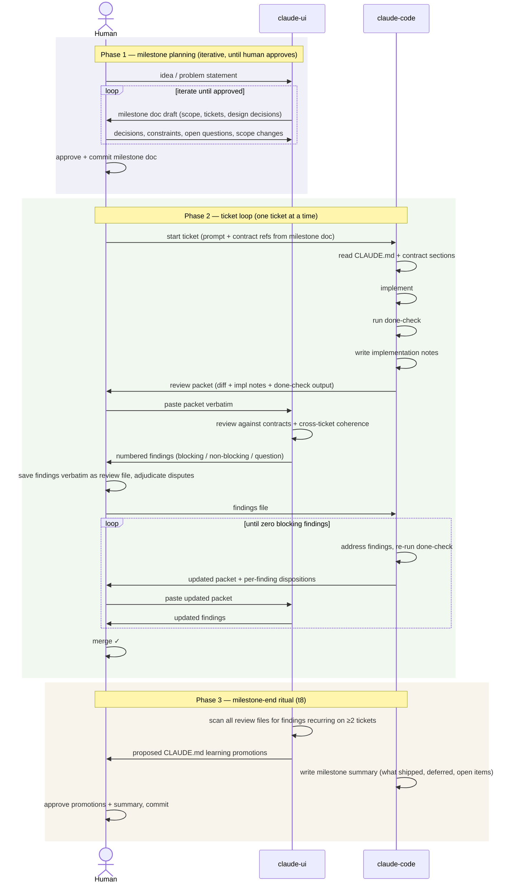

# The triad development loop

Visual reference for the working agreement between the three actors:
**claude-ui** (design, review), **claude-code** (implementation), **human** (arbiter).

See `milestone-methodology.md` for the full normative rules. This file is the
at-a-glance companion — diagram first, prose summary below.

---

## Diagram

---

## Phase summaries

### Phase 1 — milestone planning

**Who:** human + claude-ui only. claude-code is not involved.

**What happens:** The human brings an idea, problem statement, or rough scope.
claude-ui drafts the milestone doc — goal, what is NOT in scope, design
decisions, and the full ticket set with Scope / Contract refs / Touches /
Do-not-generate / Done-check / Claude-code prompt sections per methodology §6.

This goes back and forth — the human asks questions, challenges scope, adds
constraints, resolves open questions. claude-ui updates the doc each round.
The loop closes when the human approves and commits the milestone doc to the
repo. Nothing moves to Phase 2 until that commit exists.

**Key rule:** scope changes happen here, in the milestone doc. They never
happen in issue comments or chat. The committed doc is the single source of
truth.

---

### Phase 2 — ticket loop

**Who:** all three actors. Human is the relay between claude-ui and claude-code
— they never communicate directly.

**What happens, per ticket:**

1. Human starts the ticket by pasting the Claude-code prompt from the milestone
   doc into a claude-code session. Contract refs are read, not restated.
2. claude-code reads `CLAUDE.md` learning sections and referenced contract
   sections, implements, runs the done-check, writes implementation notes, and
   sends the review packet to the human.
3. Human pastes the packet verbatim into claude-ui (this chat). No paraphrasing
   — paraphrase is the lossy step the format exists to prevent.
4. claude-ui reviews against the contracts and cross-ticket coherence, and
   returns numbered findings (blocking / non-blocking / question).
5. Human saves the findings verbatim as a review file in the repo
   (`docs/reviews/m-<name>-t<N>-review.md`) and sends it to claude-code.
6. claude-code addresses each finding, re-runs the done-check, and returns an
   updated packet with a per-finding disposition table
   (`fixed | disagree (reason) | deferred (backlog ref)`).
7. Disagreements go to the human to adjudicate — claude-ui does not get
   overruled by claude-code, only by the human.
8. Repeat until zero blocking findings remain. Human merges.

**Key rules:**
- A review packet without done-check output is returned unreviewed.
- Implementation notes are a required deliverable — not optional prose.
- Anything outside the ticket's `Touches` list needs a note in the
  implementation notes; silent scope creep is a blocking finding.

---

### Phase 3 — milestone-end ritual

**Who:** claude-ui scans, claude-code writes, human approves.

**What happens:**

1. claude-ui scans all review files for the milestone. Any finding class that
   appeared on ≥2 tickets is a candidate for promotion to `CLAUDE.md` as a
   standing instruction (bold one-line rule + 1–3 sentences of why +
   `Source: m-<name> t<N>,t<M>`).
2. claude-code writes the milestone summary at the bottom of the milestone doc:
   what shipped, what was deferred (with → m-next refs), surprises, and open
   items for the next milestone. Input is the implementation notes files, not
   the diffs.
3. Human reviews and approves both. The promoted learning entries are committed
   so the next milestone starts with them in standing instructions.

**The test:** the same finding class should not appear as `blocking` in two
consecutive milestones. If it does, the promoted rule was too vague.

---

## Who owns what

| Artifact | Author | Reviewer |
|---|---|---|
| Milestone doc | claude-ui drafts, human approves | human |
| GH milestone + issues | claude-code (generated from doc) | human (spot-check) |
| Code + tests | claude-code | claude-ui (design), human (merge) |
| Implementation notes | claude-code | claude-ui |
| Done-check output | claude-code (must be in packet) | claude-ui |
| Review files | claude-ui (saved verbatim by human) | claude-code (dispositions) |
| CLAUDE.md learning entries | claude-code (from promoted findings) | human |
| Milestone summary | claude-code | human |

---

## Anti-patterns to avoid

| Anti-pattern | What goes wrong |
|---|---|
| Human paraphrases findings before sending to claude-code | claude-code fixes the paraphrase, not the finding |
| Scope change made in an issue comment | Milestone doc and issues diverge; next reader trusts the wrong one |
| Review packet sent without done-check output | Review time spent on "does it run" instead of design |
| Implementation notes omitted | Decisions exist only in chat; not recoverable from the diff |
| Same finding raised on ≥2 tickets without promotion | Learning loop stays open; review effort rented, not invested |
