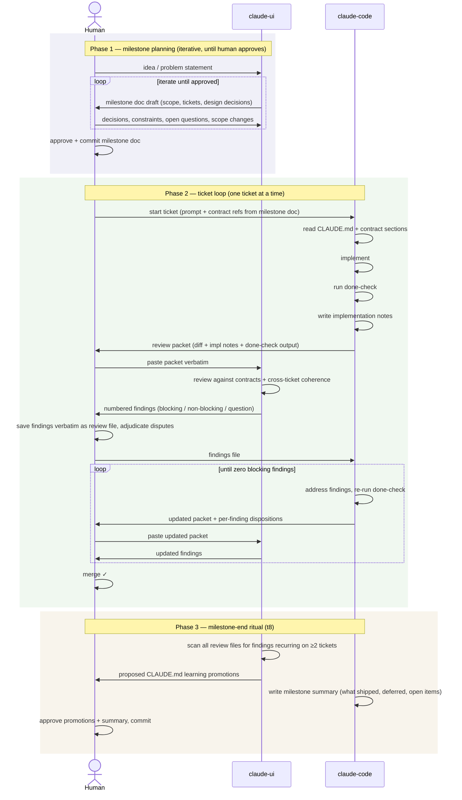

# The triad development loop

Visual reference for the working agreement between the three actors:
**claude-ui** (design, review), **claude-code** (implementation), **human** (arbiter).

See `milestone-methodology.md` for the full normative rules. This file is the
at-a-glance companion — diagram first, prose summary below.

---

## Diagram

```mermaid
sequenceDiagram
    actor H as Human
    participant CU as claude-ui
    participant CC as claude-code

    rect rgb(240, 240, 248)
        Note over H,CU: Phase 1 — milestone planning (iterative, until human approves)
        H->>CU: idea / problem statement
        loop iterate until approved
            CU->>H: milestone doc draft (scope, tickets, design decisions)
            H->>CU: decisions, constraints, open questions, scope changes
        end
        H->>H: approve + commit milestone doc
    end

    rect rgb(240, 248, 240)
        Note over H,CC: Phase 2 — ticket loop (one ticket at a time)
        H->>CC: start ticket (prompt + contract refs from milestone doc)
        CC->>CC: read CLAUDE.md + contract sections
        CC->>CC: implement
        CC->>CC: run done-check
        CC->>CC: write implementation notes
        CC->>H: review packet (diff + impl notes + done-check output)
        H->>CU: paste packet verbatim
        CU->>CU: review against contracts + cross-ticket coherence
        CU->>H: numbered findings (blocking / non-blocking / question)
        H->>H: save findings verbatim as review file, adjudicate disputes
        H->>CC: findings file
        loop until zero blocking findings
            CC->>CC: address findings, re-run done-check
            CC->>H: updated packet + per-finding dispositions
            H->>CU: paste updated packet
            CU->>H: updated findings
        end
        H->>H: merge ✓
    end

    rect rgb(248, 244, 236)
        Note over H,CC: Phase 3 — milestone-end ritual (t8)
        CU->>CU: scan all review files for findings recurring on ≥2 tickets
        CU->>H: proposed CLAUDE.md learning promotions
        CC->>CC: write milestone summary (what shipped, deferred, open items)
        H->>H: approve promotions + summary, commit
    end
```

---

## Phase summaries

### Phase 1 — milestone planning

**Who:** human + claude-ui only. claude-code is not involved.

**What happens:** The human brings an idea, problem statement, or rough scope.
claude-ui drafts the milestone doc — goal, what is NOT in scope, design
decisions, and the full ticket set with Scope / Contract refs / Touches /
Do-not-generate / Done-check / Claude-code prompt sections per methodology §6.

This goes back and forth — the human asks questions, challenges scope, adds
constraints, resolves open questions. claude-ui updates the doc each round.
The loop closes when the human approves and commits the milestone doc to the
repo. Nothing moves to Phase 2 until that commit exists.

**Key rule:** scope changes happen here, in the milestone doc. They never
happen in a tracker comment or in chat. The committed doc is the single
source of truth.
`[Corrected 2026-08-17 at the ds cycle's open, with milestone-methodology.md
§1 item 1, which carries the ground. "Tracker" replaces "issues" in this
document's normative rows; a cycle names its own tracker or states that it
uses none.]`

---

### Phase 2 — ticket loop

**Who:** all three actors. Human is the relay between claude-ui and claude-code
— they never communicate directly.

**What happens, per ticket:**

1. Human starts the ticket by pasting the Claude-code prompt from the milestone
   doc into a claude-code session. Contract refs are read, not restated.
2. claude-code reads `CLAUDE.md` learning sections and referenced contract
   sections, implements, runs the done-check, writes implementation notes, and
   sends the review packet to the human.
3. Human pastes the packet verbatim into claude-ui (this chat). No paraphrasing
   — paraphrase is the lossy step the format exists to prevent.
4. claude-ui reviews against the contracts and cross-ticket coherence, and
   returns numbered findings (blocking / non-blocking / question).
5. Human saves the findings verbatim as a review file in the repo
   (`docs/reviews/m-<name>-t<N>-review.md`) and sends it to claude-code.
6. claude-code addresses each finding, re-runs the done-check, and returns an
   updated packet with a per-finding disposition table
   (`fixed | disagree (reason) | deferred (backlog ref)`).
7. Disagreements go to the human to adjudicate — claude-ui does not get
   overruled by claude-code, only by the human.
8. Repeat until zero blocking findings remain. Human merges.

**Key rules:**
- A review packet without done-check output is returned unreviewed.
- Implementation notes are a required deliverable — not optional prose.
- Anything outside the ticket's `Touches` list needs a note in the
  implementation notes; silent scope creep is a blocking finding.

### Doc edits are section-scoped (claude-ui never replaces a whole file)

claude-ui has no repo access, so every doc change it proposes is generated from a context
snapshot rather than read from HEAD. A whole-file replacement built that way can only be
last-write-wins: it silently discards anything committed to that file since the snapshot, and
with no diff the discard is invisible. This failed twice in two turns — once inserting phantom
corrections (fixing text HEAD never contained), once reverting three real fixes committed since
the snapshot — the same bug in both directions. So claude-ui emits **section-scoped edits
only**: "replace §t3 with …", "add this rev-log entry", "change the §Contract refs line to X" —
never a full-file body. A scoped edit is merge-safe by construction — it cannot revert what it
does not mention — so unrelated corrections survive automatically. The arbiter applies each edit
against HEAD and diffs before committing; that diff is the optimistic-lock check, and it lives
where the diff capability actually is. A scoped edit built on a stale reading of its own section
can still be wrong on the merits — but that is a review question the diff surfaces, not a silent
merge loss.

Corollary: claude-ui keeps no writable mirror of a repo-owned doc. A mirror is a second writable
copy of a file whose source of truth is the repo — a cache with no invalidation, and the drift
surface both failures came through; dropping it removes the surface. The repo doc is canonical.
claude-ui owns ratification — what the doc should say — and the arbiter owns the sync —
mechanically making the doc say it. Only the first is a judgment call, which is why the sync
belongs on the side that holds HEAD and the diff.

**Extended by `milestone-methodology.md` §11 (Reviewer-authoring
discipline), entry *A surgical edit is scoped by unit and quoted before it
is replaced*.** That entry declares itself a continuation of this section
and narrows the caveat above: the diff surfaces what changed, never what
should have. The rule itself is stated there and is deliberately not
restated here.

`Source: m2-cloudcost t3, 2026-08-02 — the rev 5.2 mirror write (phantom N2 items) and its
successor (three reverted F3/status fixes). Ratified with the human at the t3 close.
Reverse pointer added 2026-08-11 (gc t2): the reference was one-directional — §11 named this
section and this section named nothing back, so a reader arriving here got the rule and the caveat
with no signal that the caveat had since been narrowed. Cited by section and entry headline rather
than by ordinal, per aetheris/CLAUDE.md's cite-by-anchor rule.`

---

### Phase 3 — milestone-end ritual

**Who:** claude-ui scans, claude-code writes, human approves.

**What happens:**

1. claude-ui scans all review files for the milestone. Any finding class that
   appeared on ≥2 tickets is a candidate for promotion to `CLAUDE.md` as a
   standing instruction (bold one-line rule + 1–3 sentences of why +
   `Source: m-<name> t<N>,t<M>`).
2. claude-code writes the milestone summary at the bottom of the milestone doc:
   what shipped, what was deferred (with → m-next refs), surprises, and open
   items for the next milestone. Input is the implementation notes files, not
   the diffs.
3. Human reviews and approves both. The promoted learning entries are committed
   so the next milestone starts with them in standing instructions.

**The test:** the same finding class should not appear as `blocking` in two
consecutive milestones. If it does, the promoted rule was too vague.

---

## Who owns what

| Artifact | Author | Reviewer |
|---|---|---|
| Milestone doc | claude-ui drafts, human approves | human |
| Tracker entries, if the cycle uses a tracker | claude-code (generated from doc) | human (spot-check) |
| Code + tests | claude-code | claude-ui (design), human (merge) |
| Implementation notes | claude-code | claude-ui |
| Done-check output | claude-code (must be in packet) | claude-ui |
| Review files | claude-ui (saved verbatim by human) | claude-code (dispositions) |
| CLAUDE.md learning entries | claude-code (from promoted findings) | human |
| Milestone summary | claude-code | human |

---

## Anti-patterns to avoid

| Anti-pattern | What goes wrong |
|---|---|
| Human paraphrases findings before sending to claude-code | claude-code fixes the paraphrase, not the finding |
| Scope change made in a tracker comment | Milestone doc and tracker diverge; next reader trusts the wrong one |
| Review packet sent without done-check output | Review time spent on "does it run" instead of design |
| Implementation notes omitted | Decisions exist only in chat; not recoverable from the diff |
| Same finding raised on ≥2 tickets without promotion | Learning loop stays open; review effort rented, not invested |
